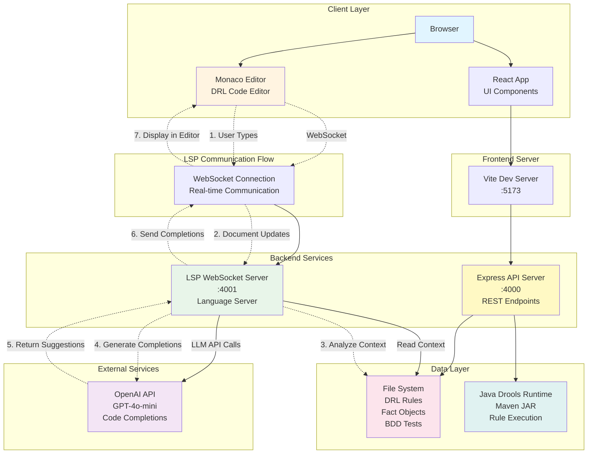
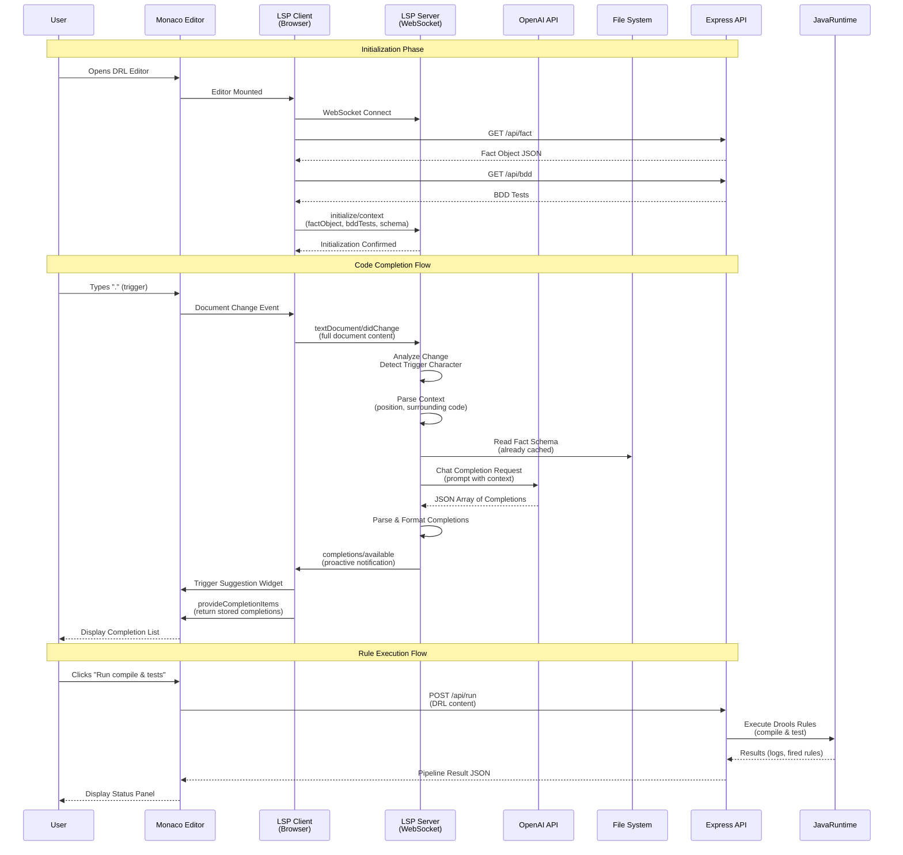
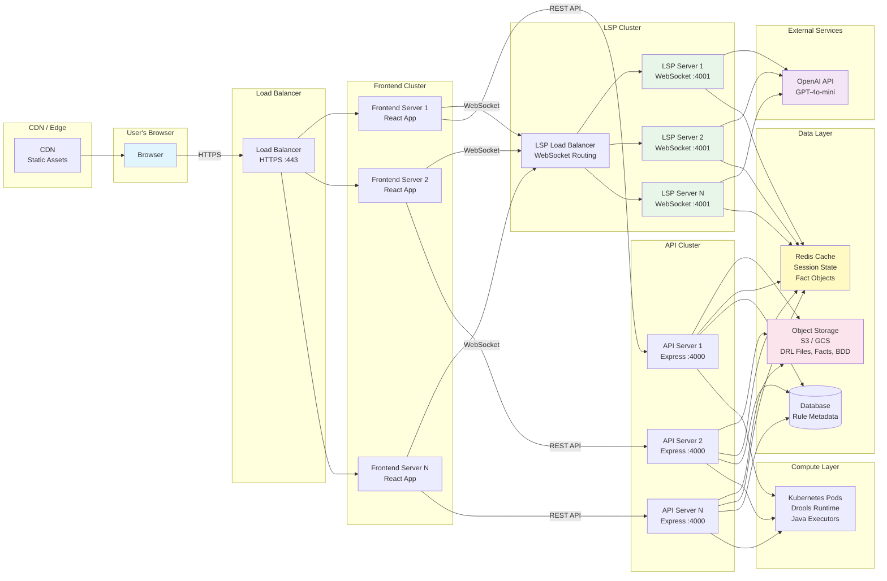

# Production Architecture Diagram

## High-Level Overview

This system provides an **AI-powered code completion service for Drools Rule Language (DRL)** using a Language Server Protocol (LSP) architecture. The solution enables intelligent, context-aware code suggestions in a Monaco-based web editor by leveraging Large Language Models (LLMs) to understand business rules, fact objects, and BDD test scenarios.

### Core Concept

When a developer types in the DRL editor, the system:
1. **Detects** trigger characters (`.`, `(`, `:`, `=`) that indicate code completion opportunities
2. **Analyzes** the current code context, fact object schema, and BDD test scenarios
3. **Generates** intelligent completion suggestions using an LLM (GPT-4o-mini)
4. **Displays** contextually relevant suggestions in real-time within the editor

### Key Components

- **Monaco Editor**: Web-based code editor with LSP client integration
- **LSP Server**: WebSocket-based language server that orchestrates completion generation
- **LLM Integration**: OpenAI API for generating context-aware code completions
- **Backend API**: RESTful service for rule management, compilation, and testing
- **Drools Runtime**: Java-based rule engine for actual rule execution and validation

### Production Architecture Principles

- **Stateless LSP Servers**: Horizontally scalable WebSocket servers
- **Real-time Communication**: WebSocket connections for low-latency completion delivery
- **Context-Aware**: Leverages fact objects and BDD tests for intelligent suggestions
- **Scalable**: Designed for cloud deployment with load balancing and caching

## System Architecture

## Detailed Component Flow

## Production Deployment Architecture

## Key Production Considerations

### Scalability
- **LSP Servers**: Stateless, can scale horizontally
- **Session Management**: Use Redis for WebSocket session state
- **Load Balancing**: WebSocket sticky sessions for LSP connections

### Security
- **API Keys**: Stored in secure secret management (AWS Secrets Manager, etc.)
- **HTTPS/WSS**: All connections encrypted
- **Rate Limiting**: Per-user limits on LLM API calls
- **Authentication**: User authentication before LSP connection

### Performance
- **Caching**: Fact objects and BDD tests cached in Redis
- **Connection Pooling**: Reuse OpenAI API connections
- **Async Processing**: Non-blocking LLM calls
- **CDN**: Static assets served from edge locations

### Monitoring
- **Metrics**: Completion latency, LLM API usage, error rates
- **Logging**: Centralized logging (ELK, CloudWatch, etc.)
- **Alerting**: Monitor LLM API failures, high latency

